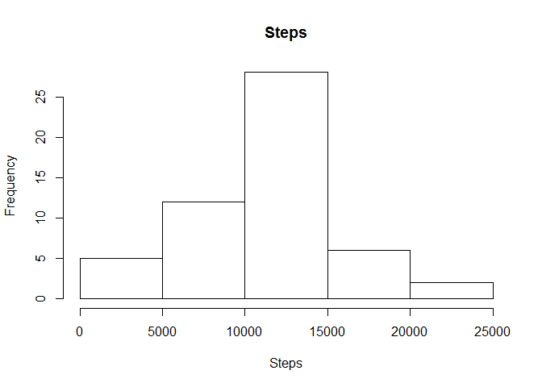
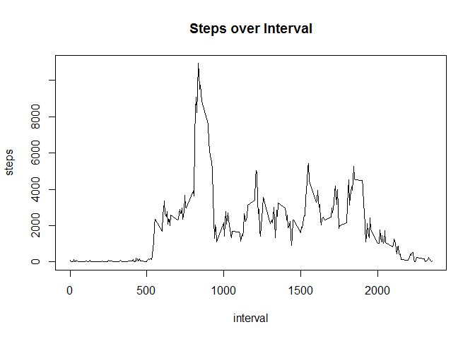
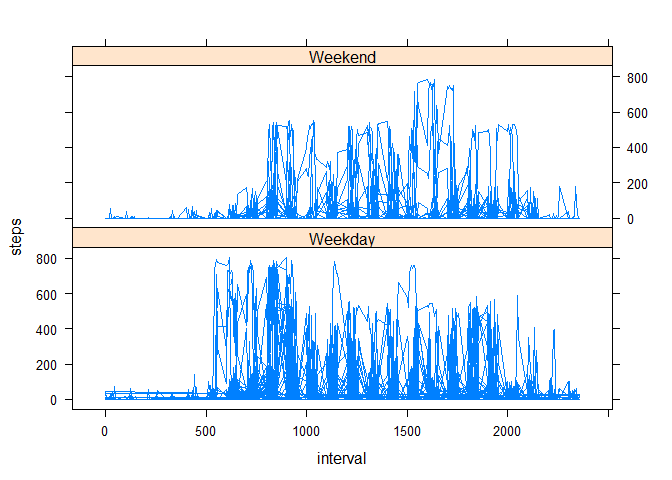

# Peer Assessment 1 - Reproducible Research


## Loading and preprocessing the data
Loading and preprocessing the data:

```r
setwd("activity")
data <- read.csv("activity.csv")
data$date <- as.Date(data$date)
ag <- aggregate(steps ~ date, data, sum)
```

## What is mean total number of steps taken per day?


```r
hist(ag$steps, xlab="Steps", main="Steps")
```

 

```r
mean(ag$steps)
```

```
## [1] 10766.19
```

```r
median(ag$steps)
```

```
## [1] 10765
```

## What is the average daily activity pattern?

```r
ag <- aggregate(steps ~ interval, data, sum)
plot(x=ag$interval, y=ag$steps, type="l", xlab="interval", ylab="steps", main="Steps over Interval")
```

 

```r
#interval with max steps
ag[which(ag$steps==max(ag$steps)), ]
```

```
##     interval steps
## 104      835 10927
```

```r
sum(is.na(data))
```

```
## [1] 2304
```
Fill NAs with the median for that 5 minute interval

```r
data$steps[is.na(data$steps)] <- with(data, ave(steps, interval, FUN = function(x) median(x, na.rm=TRUE)))[is.na(data$steps)]
ag <- aggregate(steps ~ date, data, sum)
```

### Histogram Steps

```r
hist(ag$steps, xlab="Steps", main="Steps")
```

 

```r
mean(ag$steps)
```

```
## [1] 9503.869
```

```r
median(ag$steps)
```

```
## [1] 10395
```

## Are there differences in activity patterns between weekdays and weekends?


```r
library(dplyr)
```

```
## 
## Attaching package: 'dplyr'
## 
## The following object is masked from 'package:stats':
## 
##     filter
## 
## The following objects are masked from 'package:base':
## 
##     intersect, setdiff, setequal, union
```

```r
library(lattice)
data$weekday <- weekdays(data$date) %in% c("Saturday", "Sunday")
data$weekday <- as.factor(data$weekday)
levels(data$weekday) = c("Weekday", "Weekend")

ag <- data %>% select(-(date)) %>% group_by(weekday, interval) %>% summarise_each(funs(mean))

xyplot(steps ~ interval | weekday, data, type = "l", layout = c(1,2))
```

 

